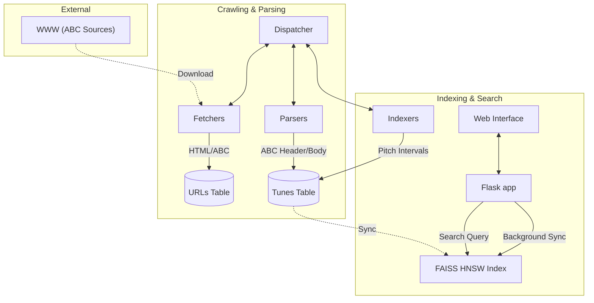
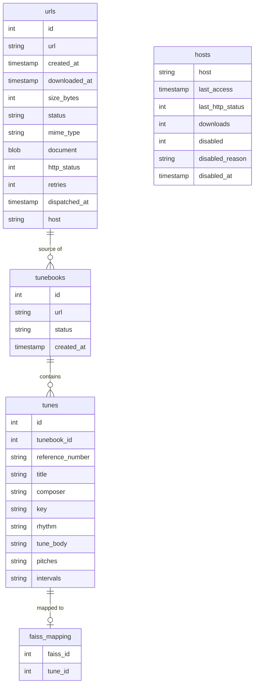

# Web Crawler & ABC Music Search System

Een geavanceerd multi-process web crawler systeem gebouwd in Python, gespecializeerd in het vinden, indexeren en doorzoeken van ABC muziek nota's.

## Belangrijkste Features

- **Melodie Zoeken (FAISS HNSW)**: Zoek naar tunes op basis van muzikale gelijkenis met behulp van een high-performance vector index.
- **ABC Indexing**: Automatische extractie van metadata (titel, toonsoort, ritme, etc.) en muzikale intervallen uit ABC bestanden.
- **Multi-process Architectuur**: Schaalbaar systeem met onafhankelijke dispatchers, fetchers, parsers, indexers en purgers.
- **Real-time Controle**: Volledige beheer-interface via Flask voor het monitoren van processen en statistieken.

## Componenten

### 1. URL Dispatcher (`url_dispatcher.py`)
- Beheert de centrale werk-wachtrij vanuit SQLite.
- Verdeelt opdrachten over fetchers, parsers en indexers via socket-verbindingen.
- Garandeert dat taken efficiënt en zonder conflicten worden verdeeld.

### 2. URL Fetcher (`url_fetcher.py`)
- Downloadt documenten en extraheert hyperlinks voor verdere crawling.
- Respecteert `robots.txt` en past beleefdheids-vertragingen toe per host.

### 3. URL Parser (`url_parser.py`)
- Verwerkt gedownloade documenten met de `abc_parser.py` module.
- Identificeert ABC muziekblokken en slaat individuele tunes op met metadata.

### 4. ABC Indexer (`abc_indexer.py`)
- Berekent 32-dimensionale pitch-interval vectoren voor elke tune.
- Normaliseert muzikale intervallen om transpositie-invariant zoeken mogelijk te maken.

### 5. FAISS Sync & Search (`app.py` & `vector_index.py`)
- Een achtergrond-thread in de Flask app synchroniseert berekende intervallen naar een FAISS HNSW index.
- Maakt bliksemsnelle "Nearest Neighbor" zoekopdrachten mogelijk op basis van melodie.

### 6. URL Purger (`url_purger.py`)
- Ruimt de database periodiek op (verwijderen van ongewenste extensies en problematische hosts).

## Installatie

1. Installeer de systeem-dependencies (bijv. `faiss-cpu`, `numpy`, `music21`):
```bash
pip install -r requirements.txt
```

2. Initialiseer de database:
```bash
python database.py
```

## Data & Process Flow



## Database Schema



### Belangrijkste Tabellen

- **`urls`**: De centrale tabel voor alle gecrawlde en nog te crawlen links. Bevat de ruwe content (document) en status.
- **`hosts`**: Houdt per host de `last_access` bij voor rate-limiting en DNS status.
- **`tunebooks`**: Groepeert tunes die van dezelfde bron-URL komen. De `status` kolom geeft aan of de tunes al geëxtraheerd zijn.
- **`tunes`**: Bevat de muzikale metadata en de berekende `pitches` en `intervals`.
- **`faiss_mapping`**: De koppeling tussen de interne ID's van de FAISS index en de `tune_id` in SQLite.

## Gebruik

1. Start het volledige systeem:
```bash
make start
# of start handmatig de Flask app:
python app.py
```

2. Interface:
Ga naar `http://localhost:5500` om:
- Processen te beheren (toevoegen/verwijderen van fetchers/indexers).
- Statistieken te bekijken (Crawling voortgang, FAISS index grootte).
- **Melody Search**: Voer een reeks MIDI pitches in (bijv. `60, 62, 64`) om gelijkaardige melodieën te vinden.

## Architectuur & Communicatie

Het systeem gebruikt een ster-architectuur waarbij de `Dispatcher` het middelpunt is. Communicatie verloopt via JSON-over-sockets, wat een robuuste scheiding van taken mogelijk maakt. De FAISS index wordt beheerd volgens het "Single Writer" principe in de Flask app om data-corruptie te voorkomen.

---
*Ontwikkeld voor het efficiënt verzamelen en analyseren van traditionele muziek.*

