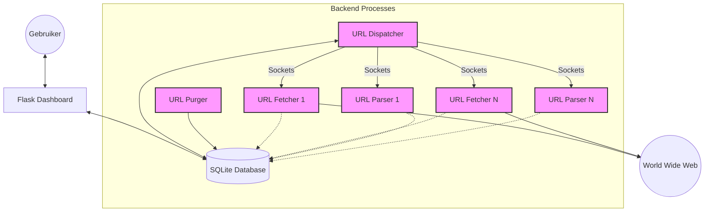

# Web Crawler & ABC Parser System

Een multi-process web crawler en ABC muzieknotatie parser systeem gebouwd in Python met SQLite als backend. Het systeem is ontworpen om muziekwebsites te crawlen, ABC-bestanden te downloaden en muzikale data (inclusief MIDI pitches) te extraheren.

## Componenten

### 1. URL Dispatcher (`url_dispatcher.py`)
- Beheert de centrale queue en coördineert werkzaamheden.
- Deelt URLs uit aan **Fetchers** (voor downloaden) en **Parsers** (voor verwerken).
- Handhaaft "politeness" regels (cooldown per host).
- Luistert op poort 8888 voor socket-verbindingen.

### 2. URL Fetcher (`url_fetcher.py`)
- Downloadt documenten via de dispatcher.
- Extraheert hyperlinks en voegt ze toe aan de queue.
- Respecteert `robots.txt` en filtert op MIME-types.
- Meerdere instanties kunnen parallel draaien.

### 3. URL Parser (`url_parser.py`)
- Verwerkt gedownloade documenten met de status 'fetched'.
- Gebruikt `abc_parser.py` om ABC-muzieknotatie te vinden.
- Extraheert metadata (Titel, Componist, Sleutel, etc.) en **MIDI Pitches** (via `music21`).
- Slaat resultaten op in de `tunebooks` en `tunes` tabellen.
- Meerdere instanties kunnen parallel draaien.

### 4. URL Purger (`url_purger.py`)
- Onderhoudsproces dat periodiek de database opschoont.
- Verwijdert URLs met geweigerde extensies of hosts met DNS-fouten.

### 5. Flask Web Interface (`app.py`)
- Dashboard voor procesbeheer (Start/Stop Dispatcher, Purger, Fetchers, Parsers).
- Real-time statistieken (Totaal URLs, Geparsede documenten, Gevonden tunes).
- Configuratie van MIME-types en geweigerde extensies.
- URL-queue monitoring en beheer.

## Architectuur & Workflow

Het systeem volgt een drie-fasen pipeline:
1. **Crawl**: De Dispatcher stuurt nieuwe URLs naar Fetchers.
2. **Fetch**: Fetchers downloaden de content en slaan deze op als BLOB. De status wordt 'fetched'.
3. **Parse**: De Dispatcher stuurt 'fetched' URLs naar Parsers. Parsers extraheren muziekdata en zetten de status op 'parsed'.

### Data & Proces Flow


## Database Schema

Het systeem gebruikt een SQLite database (`crawler.db`) met de volgende tabellen:

### 1. `urls` (De centrale queue)
- `id`: Primaire sleutel.
- `url`: De unieke URL.
- `host`: De hostnaam (bijv. 'example.com').
- `created_at`: Tijdstip van toevoegen.
- `dispatched_at`: Wanneer de URL is uitgedeeld aan een Fetcher/Parser.
- `downloaded_at`: Tijdstip van download door de Fetcher.
- `size_bytes`: Grootte van het document (0 indien 'erased').
- `status`: Huidige staat ('', 'dispatched', 'fetched', 'parsing', 'parsed', 'error').
- `mime_type`: Content-type van de URL.
- `http_status`: HTTP response code (bijv. 200, 404).
- `retries`: Aantal mislukte pogingen.
- `document`: De ruwe content (BLOB) of de tekst 'erased' voor opgeschoonde records.
- `has_abc`: Boolean, `1` als het document ABC muziekstukken bevat.

### 2. `hosts` (Beheer van politeness en DNS)
- `host`: De hostnaam.
- `last_access`: Tijdstip van het laatste verzoek.
- `last_http_status`: Laatste HTTP status van deze host.
- `downloads`: Totaal aantal succesvolle downloads van deze host.
- `disabled`: Boolean, `1` als de host is uitgeschakeld.
- `disabled_reason`: Reden van uitschakeling (bijv. 'dns').
- `disabled_at`: Tijdstip van uitschakeling.

### 3. `tunebooks` (Groepering van tunes)
- `id`: Primaire sleutel.
- `url`: De unieke URL van het bronbestand.
- `created_at`: Tijdstip van extractie.

### 4. `tunes` (Geëxtraheerde muziekdata)
- `id`: Primaire sleutel.
- `tunebook_id`: Foreign key naar `tunebooks`.
- `reference_number`: (X) Het referentienummer.
- `title`: (T) De titel van de tune.
- `composer`: (C) De componist.
- `origin`: (O) Herkomst.
- `area`: (A) Gebied.
- `meter`: (M) Maatsoort.
- `unit_note_length`: (L) Standaard nootlengte.
- `tempo`: (Q) Tempo informatie.
- `parts`: (P) Onderdelen van de tune.
- `transcription`: (Z) Transscribent.
- `notes`: (N) Notities.
- `group`: (G) Groep.
- `history`: (H) Historie.
- `key`: (K) Toonsoort.
- `rhythm`: (R) Ritme.
- `book`: (B) Boek referentie.
- `discography`: (D) Discografie.
- `source`: (S) Bron.
- `instruction`: (I) Instructies.
- `tune_body`: De ruwe ABC-notatie van de melodie.
- `pitches`: Komma-gescheiden lijst van MIDI pitches.
- `intervals`: (Legacy) Oude kolom voor intervallen (nu leeg).

### 5. `mime_types` (Configuratie van downloads)
- `id`: Primaire sleutel.
- `pattern`: MIME-type patroon (bijv. `text/*`).
- `enabled`: Of dit type toegestaan is (1/0).

### 6. `refused_extensions` (Filters op bestandstype)
- `extension`: De extensie (bijv. 'exe', 'zip').
- `reason`: Reden voor weigering.
- `created_at`: Tijdstip van toevoegen aan blacklist.

### 7. `processes` (Procesbeheer)
- `id`: Primaire sleutel.
- `pid`: Process ID van het lokale OS.
- `type`: Type proces (fetcher, parser, purger, etc.).
- `status`: Huidige status ('running', etc.).
- `started_at`: Tijdstip van opstarten.

## Installatie & Gebruik

1. **Requirements**:
   ```bash
   pip install -r requirements.txt
   ```
   *Opmerking: `music21` is vereist voor pitch-extractie.*

2. **Initialisatie**:
   ```bash
   python database.py
   ```

3. **Dashboard Starten**:
   ```bash
   python app.py
   ```
   Ga naar `http://localhost:5500` om het systeem te beheren.

## Beheer via Makefile
- `make start`: Start alle basisprocessen via scripts.
- `make stop`: Stopt alle draaiende processen.
- `make status`: Toont de status van de poorten en processen.
