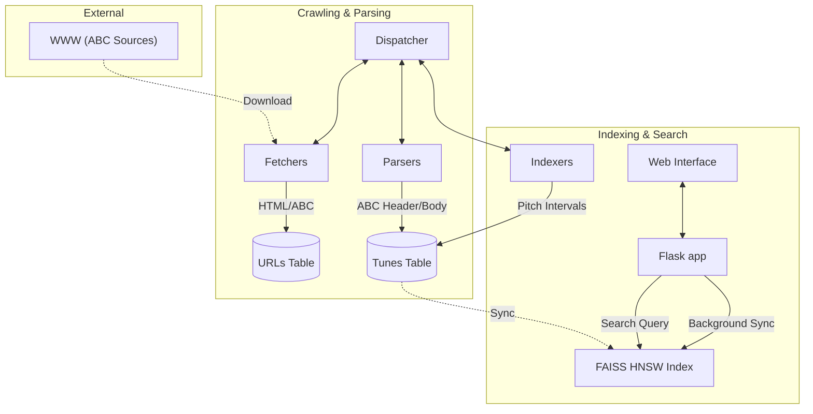
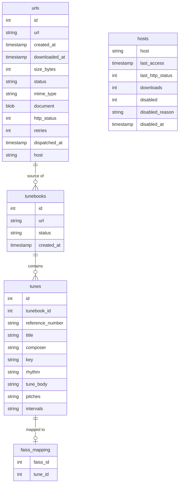
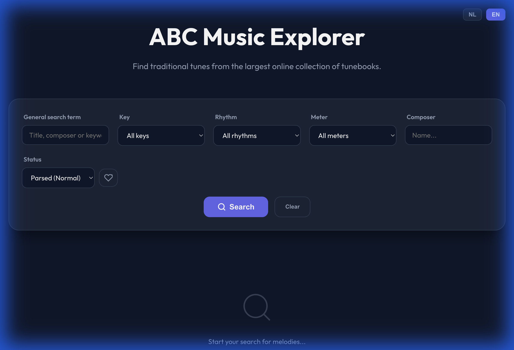
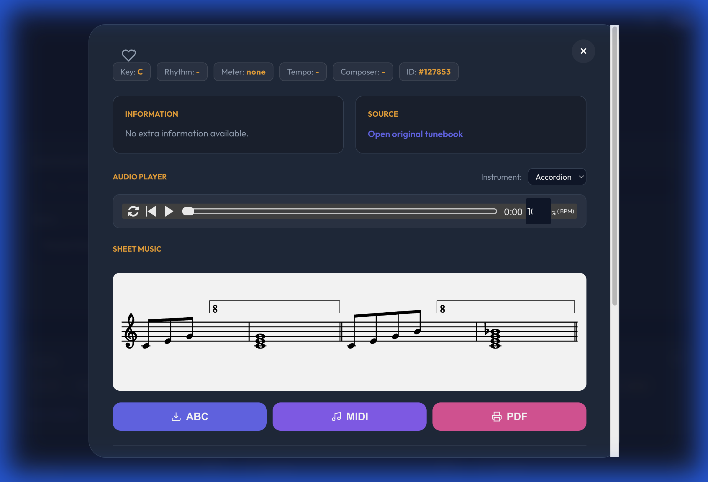
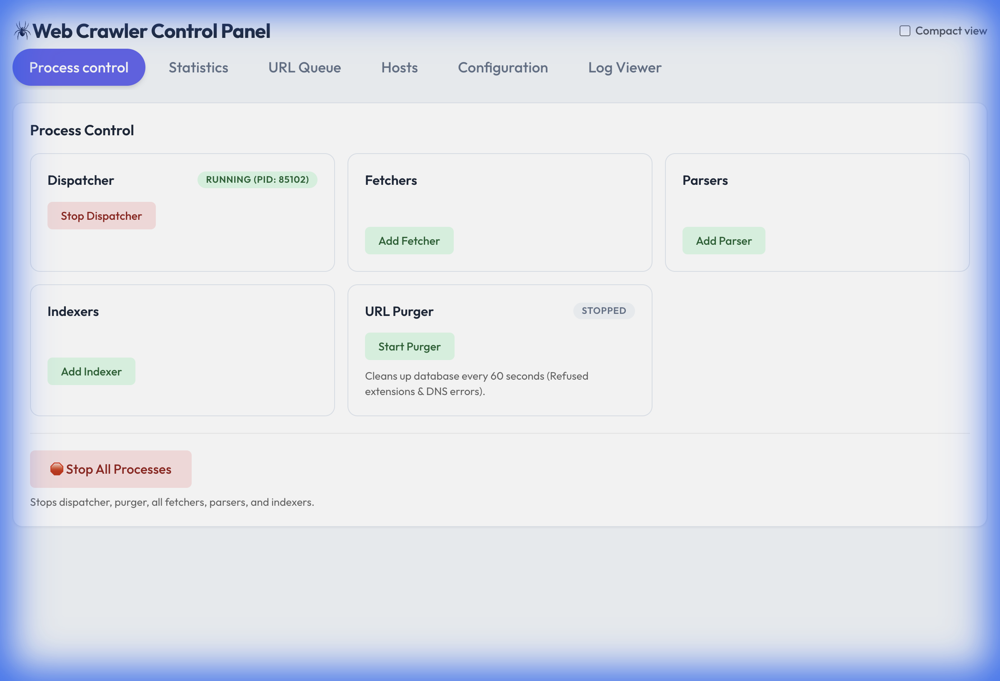

# Web Crawler & ABC Music Search System

*[Nederlandse versie hier](README_nl.md)*

An advanced multi-process web crawler system built in Python, specialized in finding, indexing, and searching ABC music notation.

## Key Features

- **Melody Search (FAISS HNSW)**: Search for tunes based on musical similarity using a high-performance vector index.
- **ABC Indexing**: Automatic extraction of metadata (title, key, rhythm, etc.) and musical intervals from ABC files.
- **Multi-process Architecture**: Scalable system with independent dispatchers, fetchers, parsers, indexers, and purgers.
- **Transpose & Export**: Transpose melodies in real-time, and export to ABC, MIDI, or PDF.
- **Real-time Control**: Full management interface via Flask for monitoring processes and statistics.

## Components

### 1. URL Dispatcher (`url_dispatcher.py`)
- Manages the central work queue from SQLite.
- Distributes assignments to fetchers, parsers, and indexers via socket connections.
- Ensures tasks are distributed efficiently and without conflicts.

## Dispatcher Strategy

The Dispatcher acts as the "brain" of the crawler and employs an advanced strategy to ensure efficiency, politeness, and robustness:

- **Atomicity & Concurrency**: Uses `BEGIN IMMEDIATE` transactions and atomic SQL `UPDATE` queries. This guarantees that a URL is claimed by exactly one fetcher at a time, even with hundreds of simultaneous requests.
- **Smart Prioritization**: 
    - **ABC-First**: URLs ending in `.abc` receive the highest priority. They are sent directly to fetchers as soon as they are discovered, regardless of their position in the general queue.
    - **Chronological**: Within the same priority level, the oldest URLs (`created_at`) are processed first.
- **Politeness & Throttling**: 
    - **Cooldown Period**: Implements a mandatory pause (default 30 seconds) between consecutive requests to the same host to prevent server overload.
    - **Exclusion**: Hosts currently marked as "disabled" (e.g., due to previous errors) are skipped entirely.
- **Fault Tolerance & Recovery**:
    - **Retry Management**: Tracks the number of attempts per URL (maximum 3). After repeated failures, a URL is marked as `error`.
    - **Host Blockade**: Temporarily disables hosts that generate consecutive timeouts, preventing fetchers from wasting time on slow or unreachable sites.
    - **Timeout Recovery**: The Purger automatically re-enables hosts that were blocked due to timeouts after a 24-hour cooldown period.
    - **Startup Recovery**: On startup, all URLs left in a `dispatched`, `parsing`, or `indexing` state from a previous session are automatically released.
    - **Liveness Checks**: URLs that have been in process for more than 120 seconds without a result are automatically returned to the queue.
- **Status Synchronization**: Synchronizes the status of the entire pipeline (`dispatched` -> `parsing` -> `indexing`) back to the central `urls` table for 100% visibility in the UI.
- **Log Scanning**: Periodically scans fetcher logs for DNS errors and blocks problematic hosts directly in the database.

### 2. URL Fetcher (`url_fetcher.py`)
- Downloads documents and extracts hyperlinks for further crawling.
- Respects `robots.txt` and applies politeness delays per host.

### 3. URL Parser (`url_parser.py`)
- Processes downloaded documents with the `abc_parser.py` module.
- Identifies ABC music blocks and saves individual tunes with metadata.

### 4. ABC Indexer (`abc_indexer.py`)
- Calculates 32-dimensional pitch-interval vectors for each tune.
- Normalizes musical intervals to enable transposition-invariant searching.

### 5. FAISS Sync & Search (`app.py` & `vector_index.py`)
- A background thread in the Flask app synchronizes calculated intervals to a FAISS HNSW index.
- Enables lightning-fast "Nearest Neighbor" searches based on melody.

### 6. URL Purger (`url_purger.py`)
- Periodically cleans detailed the database (removing unwanted extensions and problematic hosts).

## Installation

1. Install system dependencies (e.g., `faiss-cpu`, `numpy`, `music21`):
```bash
pip install -r requirements.txt
```

2. Initialize the database:
```bash
python database.py
```

## Data & Process Flow



## Database Schema



### Key Tables

- **`urls`**: The central table for all crawled and to-be-crawled links. Contains raw content (document) and status.
- **`hosts`**: Tracks `last_access` per host for rate-limiting and DNS status.
- **`tunebooks`**: Groups tunes coming from the same source URL. The `status` column indicates if tunes have been extracted.
- **`tunes`**: Contains musical metadata and calculated `pitches` and `intervals`.
- **`faiss_mapping`**: Map between internal FAISS index IDs and SQLite `tune_id`.

## Usage

1. Start the full system:
```bash
make start
# This starts: Dispatcher, Management App (port 5500) and Search App (port 5501)
```

2. Web Interfaces:
- **Management Dashboard (`http://localhost:5500`)**: Manage processes (fetchers, parsers, indexers), view crawler statistics, and configure filters.
    - **New**: Redesigned Process Control page with a clear 2-column layout and a "Stop All Processes" emergency button.
    - **New**: Real-time log streaming for individual worker processes directly in the UI.
    - **New**: Statuses in the queue now track all the way to "indexed", providing full end-to-end visibility.
- **ABC Tune Explorer (`http://localhost:5501`)**: Premium search interface for end-users.
    
    - **New**: Multi-language support (English and Dutch) via the language switcher.
    - **New**: Favorites system: Centralized, database-backed favorites allow you to save melodies permanently across sessions (linked to your browser ID).
    - **New**: Search by Tune ID (e.g., `77277`).
    - **New**: "Find Similar Tunes" button uses FAISS (fast preselection) and DTW (precise ranking) to find musical variations.
    - Includes robust sheet music rendering and audio via a local fallback of the `ABCJS` library.

## User Manual: ABC Tune Explorer

### 1. Search & Navigation

The interface is designed to provide intuitive access to thousands of traditional music.

#### Search Fields
- **General Search Field**: A powerful all-rounder.
    - *Title*: Type (part of) the title, e.g., "Glory".
    - *Tune ID*: Know the ID number? Type it directly (e.g., `77277`) to open that exact tune.
    - *Wildcards*: Search is "contains" by default, so no `*` is needed.
- **Specific Filters**:
    - *Key*: Filter by key. Use standard notation like `G` (G major), `Am` (A minor).
    - *Mode*: Filter by musical mode (e.g., Mixolydian, Dorian).
    - *Rhythm*: Filter by dance type or meter, such as `Reel`, `Jig`, `Hornpipe`, `Waltz`.
    - *Composer*: Search for tunes by or attributed to a specific person.

#### Results
Results appear immediately below the search bar in a responsive grid. Each card shows the title and key metadata. Click **"View melody"** ("Bekijk melodie") on a card to open the detail view.

### 2. Melody Detail View



This is the heart of the application, where you can read, hear, and analyze the music.

#### Visualization & Audio
- **Score**: The ABC code is automatically converted into readable sheet music.
- **Audio Player**:
    - Use the **Play/Pause** button to listen to the melody.
    - **Instrument Selector**: Choose from Piano, Violin, Flute, or Accordion.
    - **Progress Bar**: Drag to jump to a specific point.
    - **Loop Function**: Enable repetition to practice a difficult passage.
    - **Tempo**: Adjust playback speed without changing pitch.
- **Transpose**: Shift the key of the melody up or down in real-time with +1/-1 buttons. The score and audio update instantly.
- **Source Code**: View the raw ABC text ("ABC Source Code") to see how the music is notated.
- **Download & Export**: 
    - Click "ABC" to save the source text.
    - Click "MIDI" to export the audio for use in other software.
    - Click "PDF" to print or save the sheet music in high quality.

#### "Find Similar Tunes"
This advanced feature helps you discover variations and related tunes.
1.  Click the **"Find Similar Tunes"** ("Vind gelijkaardige melodieën") button at the bottom of the details.
2.  The system analyzes the *intervals* of the current melody.
3.  A list of tunes appears that are musically very similar to the current one.
    *   **Score Explanation**: The score (e.g., `3.4` or `12.1`) represents the "distance" between melodies.
        *   **0.0**: Exact match (same note sequence).
        *   **< 10.0**: Very likely a close variation or the same tune in a different setting.
        *   **> 20.0**: Melodies share characteristics but are clearly different.

### 3. System Management (Management Dashboard)



Accessible via `http://localhost:5500`. This panel is for administrators and power-users.

- **Process Control**:
    - **Dispatcher**: The brain assigning tasks. Must always be "Running".
    - **Purger**: Periodically cleans the database (removes invalid/blocked URLs).
    - **Fetchers/Parsers/Indexers**: Scalable 'workers'. Add more ("Add Fetcher") to crawl faster, or fewer to save system resources.
    - **Stop All Processes**: Red emergency button at the bottom safely stops the entire system.
- **Statistics**: Real-time charts and counters on crawler progress and index size.
- **Hosts**: Manage which websites (domains) may be accessed. You can block or unblock specific hosts here.

## Architecture & Communication

The system uses a star architecture where the `Dispatcher` is the center. Communication occurs via JSON-over-sockets, enabling robust task separation. The FAISS index is managed according to the "Single Writer" principle in the Flask app to prevent data corruption.

---
*Developed for efficient collection and analysis of traditional music.*
