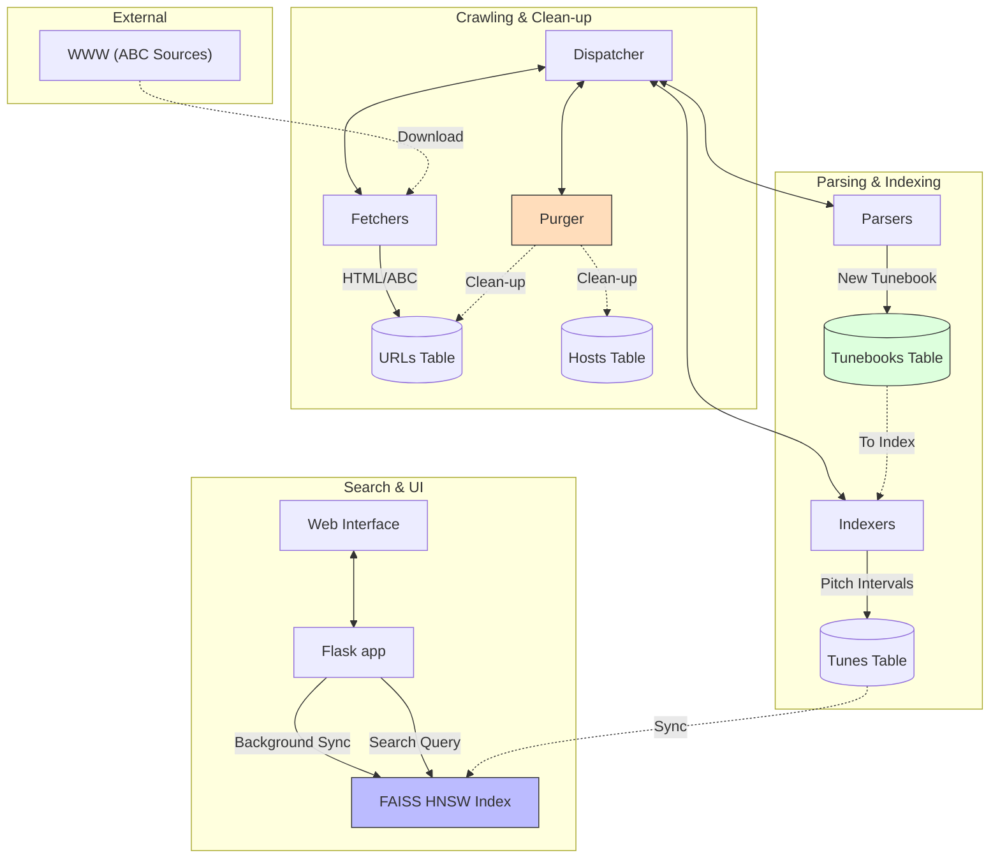
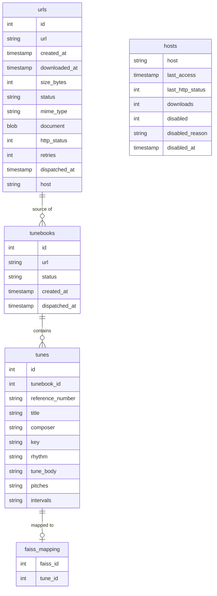

# Web Crawler & ABC Music Search System

*[English version here](README.md)*

Een geavanceerd multi-process web crawler systeem gebouwd in Python, gespecializeerd in het vinden, indexeren en doorzoeken van ABC muziek nota's.

## Belangrijkste Features

- **Melodie Zoeken (FAISS HNSW)**: Zoek naar tunes op basis van muzikale gelijkenis met behulp van een high-performance vector index.
- **ABC Indexing**: Automatische extractie van metadata (titel, toonsoort, ritme, etc.) en muzikale intervallen uit ABC bestanden.
- **Multi-process Architectuur**: Schaalbaar systeem met onafhankelijke dispatchers, fetchers, parsers, indexers en purgers.
- **Transpositie & Export**: Transponeer melodieën in real-time, en exporteer naar ABC, MIDI of PDF.
- **Real-time Controle**: Volledige beheer-interface via Flask voor het monitoren van processen en statistieken.

## Componenten

### 1. URL Dispatcher (`url_dispatcher.py`)
- Beheert de centrale werk-wachtrij vanuit SQLite.
- Verdeelt opdrachten over fetchers, parsers en indexers via socket-verbindingen.
- Garandeert dat taken efficiënt en zonder conflicten worden verdeeld.

## Dispatcher Strategie

De Dispatcher fungeert als het "brein" van de crawler en hanteert een geavanceerde strategie om efficiëntie, beleefdheid en robuustheid te waarborgen:

- **Atomiciteit & Gelijktijdigheid**: Maakt gebruik van `BEGIN IMMEDIATE` transacties en atomische SQL `UPDATE` queries. Dit garandeert dat een URL door exact één fetcher tegelijk wordt geclaimed, zelfs bij honderden gelijktijdige verzoeken.
- **Slimme Prioritering**: 
    - **ABC-Eerst**: URL's die eindigen op `.abc` krijgen de allerhoogste prioriteit. Deze worden direct naar de fetchers gestuurd zodra ze ontdekt zijn, ongeacht hun positie in de algemene wachtrij.
    - **Chronologisch**: Binnen hetzelfde prioriteitsniveau worden de oudste URL's (`created_at`) als eerste verwerkt.
- **Beleefdheid & Throttling**: 
    - **Cooldown Period**: Implementeert een verplichte pauze (standaard 30 seconden) tussen opeenvolgende verzoeken naar dezelfde host om overbelasting van servers te voorkomen.
    - **Uitsluiting**: Hosts die momenteel op "disabled" staan (bijv. door eerdere fouten) worden volledig overgeslagen.
- **Fouttolerantie & Herstel**:
    - **Retry Management**: Houdt het aantal pogingen per URL bij (maximaal 3). Na herhaalde fouten wordt een URL gemarkeerd als `error`.
    - **Host Blokkade**: Schakelt hosts tijdelijk uit die opeenvolgende timeouts genereren, om te voorkomen dat fetchers tijd verspillen aan trage of onbereikbare sites.
    - **Timeout Recovery**: De Purger re-activeert automatisch hosts die 24 uur geleden geblokkeerd zijn door timeouts, voor een nieuwe poging.
    - **Startup Recovery**: Bij het opstarten worden alle URL's die in een vorige sessie bleven hangen op `dispatched` automatisch vrijgegeven.
    - **Liveness Checks**: URL's die langer dan 120 seconden in behandeling zijn zonder resultaat, worden automatisch teruggezet naar de wachtrij.
- **Status Synchronisatie**: Synchroniseert de status van de hele pijplijn (`dispatched` -> `parsing` -> `indexing`) terug naar de centrale `urls` tabel voor 100% visibiliteit in de UI.
- **Log Scanning**: Scant periodiek de fetcher-logs op DNS-fouten en blokkeert problematische hosts direct in de database.

### 2. URL Fetcher (`url_fetcher.py`)
- Downloadt documenten en extraheert hyperlinks voor verdere crawling.
- Respecteert `robots.txt` en past beleefdheids-vertragingen toe per host.

### 3. URL Parser (`url_parser.py`)
- Verwerkt gedownloade documenten met de `abc_parser.py` module.
- Identificeert ABC muziekblokken en slaat individuele tunes op met metadata.

### 4. ABC Indexer (`abc_indexer.py`)
- Berekent 32-dimensionale pitch-interval vectoren voor elke tune.
- Normaliseert muzikale intervallen om transpositie-invariant zoeken mogelijk te maken.

### 5. FAISS Sync & Search (`app.py` & `vector_index.py`)
- Een achtergrond-thread in de Flask app synchroniseert berekende intervallen naar een FAISS HNSW index.
- Maakt bliksemsnelle "Nearest Neighbor" zoekopdrachten mogelijk op basis van melodie.

### 6. URL Purger (`url_purger.py`)
- Ruimt de database periodiek op (verwijderen van ongewenste extensies en problematische hosts).

## Installatie

1. Installeer de systeem-dependencies (bijv. `faiss-cpu`, `numpy`, `music21`):
```bash
pip install -r requirements.txt
```

2. Initialiseer de database:
```bash
python database.py
```

## Data & Process Flow



## Database Schema



### Belangrijkste Tabellen

- **`urls`**: De centrale tabel voor alle gecrawlde en nog te crawlen links. Bevat de ruwe content (document) en status. Statussen: `''` (nieuw), `dispatched`, `fetched`, `parsing`, `parsed`, `indexed`, `error`.
- **`hosts`**: Houdt per host de `last_access` bij voor rate-limiting en DNS status.
- **`tunebooks`**: Groepeert tunes die van dezelfde bron-URL komen. De `status` kolom geeft aan of de tunes al geëxtraheerd zijn. (Statussen: `''`, `indexing`, `indexed`).
- **`tunes`**: Bevat de muzikale metadata en de berekende `pitches` en `intervals`.
- **`faiss_mapping`**: De koppeling tussen de interne ID's van de FAISS index en de `tune_id` in SQLite.

## Gebruik

1. Start het volledige systeem:
```bash
make start
# Dit start: Dispatcher, Management App (poort 5500) en Search App (poort 5501)
```

2. Web Interfaces:
- **Management Dashboard (`http://localhost:5500`)**: Beheer van processen (fetchers, parsers, indexers), bekijk crawler statistieken en configureer filters.
    - **Nieuw**: Statussen in de wachtrij lopen nu door tot **"indexed"**, zodat je precies ziet wanneer een URL volledig verwerkt is.
    - **Nieuw**: Robuuste timeout-logica zorgt dat vastgelopen "dispatched" URLs automatisch worden vrijgegeven.
    - **Nieuw**: Individuele log-files per worker proces zijn direct in de UI te bekijken.
    - De interface ververst elke 3 seconden voor een vlot resultaat zonder de database te overbelasten.
- **ABC Tune Explorer (`http://localhost:5501`)**: De premium zoek-interface voor eindgebruikers.
    
    - **Nieuw**: Meertalige ondersteuning (Nederlands en Engels) via de taalschakelaar rechtsboven.
    - **Nieuw**: Favorieten-systeem: Markeer je favoriete tunes met het hart-icoon en filter de resultatenlijst om alleen je opgeslagen melodieën te zien.
    - **Nieuw**: Zoek op Tune ID (bijv. `77277`).
    - **Nieuw**: "Vind gelijkaardige melodieën" knop maakt gebruik van FAISS (snelle voorselectie) en DTW (precieze ranking) om muzikale variaties te vinden.
    - Bevat robuuste rendering van bladmuziek en audio via een lokale fallback van de `ABCJS` bibliotheek.

## Gebruikershandleiding: ABC Tune Explorer

### 1. Zoeken & Navigeren

De interface is ontworpen om intuïtief toegang te geven tot duizenden traditionele melodieën.

#### Zoekvelden
- **Algemeen Zoekveld**: Dit is een krachtige alleskunner.
    - *Titel*: Typ (een deel van) de titel, bijv. "Glory".
    - *Tune ID*: Weet je het ID nummer? Typ het direct in (bijv. `77277`) om exact die tune te openen.
    - *Wildcards*: Zoeken is standaard "bevat", dus je hoeft geen `*` te gebruiken.
- **Specifieke Filters**:
    - *Key (Toonsoort)*: Filter op toonsoort. Gebruik standaard notatie zoals `G` (G majeur), `Am` (A mineur), `Dmix` (D Mixolydisch).
    - *Rhythm (Ritme)*: Filter op type dans of metrum, zoals `Reel`, `Jig`, `Hornpipe`, `Waltz`.
    - *Composer (Componist)*: Zoek naar tunes van of toegeschreven aan een specifieke persoon.

#### Resultaten
De resultaten verschijnen direct onder de zoekbalk in een responsive grid. Elke kaart toont de titel en de belangrijkste metadata. Klik op **"Bekijk melodie"** op een kaart om het detailvenster te openen.

### 2. Melodie Detailvenster


Dit is het hart van de applicatie, waar je de muziek kunt lezen, horen en analyseren.

#### Muziekweergave & Audio
- **Partituur**: De ABC code wordt automatisch omgezet naar leesbare bladmuziek.
- **Audio Speler**:
    - Gebruik de **Play/Pause** knop om de melodie te beluisteren.
    - **Instrument Selector**: Kies tussen Piano, Viool, Fluit of Accordeon.
    - **Progres Bar**: Sleep om naar een specifiek punt te springen.
    - **Loop Functie**: Schakel herhaling in om een lastige passage te oefenen.
    - **Tempo**: Pas de afspeelsnelheid aan zonder de toonhoogte te veranderen.
- **Transponeren**: Verhoog of verlaag de toonsoort van de melodie in real-time met de +1/-1 knoppen. De partituur en audio passen zich direct aan.
- **Broncode**: Bekijk de ruwe ABC tekst ("ABC Broncode") om te zien hoe de muziek genoteerd is.
- **Download & Export**: 
    - Klik op "ABC" om de brontekst op te slaan.
    - Klik op "MIDI" om het audiobestand te exporteren voor gebruik in andere software.
    - Klik op "PDF" om de partituur in hoge kwaliteit af te drukken of op te slaan.

#### "Vind gelijkaardige melodieën"
Deze geavanceerde functie helpt je varianten en gerelateerde tunes te ontdekken.
1.  Klik op de knop **"Vind gelijkaardige melodieën"** onderaan de details.
2.  Het systeem analyseert de *intervallen* van de huidige melodie.
3.  Er verschijnt een lijst met tunes die muzikaal sterk lijken op de huidige.
    *   **Score Verklaring**: De score (bijv. `3.4` of `12.1`) is de "afstand" tussen de melodieën.
        *   **0.0**: Exacte match (dezelfde notenvolgorde).
        *   **< 10.0**: Zeer waarschijnlijk een nauwe variant of dezelfde tune in een andere setting.
        *   **> 20.0**: Melodieën delen karakteristieken maar zijn duidelijk anders.

### 3. Systeembeheer (Management Dashboard)


Bereikbaar via `http://localhost:5500`. Dit paneel is voor beheerders en power-users.

- **Process Control**:
    - **Dispatcher**: Het brein dat taken uitdeelt. Moet altijd aan staan ("Running").
    - **Purger**: Ruimt periodiek de database op (verwijdert ongeldige/geblokkeerde URL's).
    - **Fetchers/Parsers/Indexers**: Schaalbare 'workers'. Voeg er meer toe ("Add Fetcher") om sneller te crawlen, of minder om systeembronnen te sparen.
    - **Stop All Processes**: De rode noodknop onderaan stopt het hele systeem veilig.
- **Statistics**: Real-time grafieken en tellers over de voortgang van de crawler en de omvang van de index.
- **Hosts**: Beheer welke websites (domeinen) benaderd mogen worden. Je kunt hier specifieke hosts blokkeren of deblokkeren.
- **URL Queue**: Een live overzicht van alle ontdekte links. Hier kun je filteren op status (bijv. `indexed` of `error`), MIME-type en zoeken op specifieke URLs. Je kunt hier ook individuele URLs handmatig verwijderen uit de wachtrij.
- **Log Viewer**: Biedt direct inzicht in de werking van het systeem. Selecteer een specifiek proces (zoals `fetcher.1` of `parser_out`) om de real-time log-output te streamen. Essentieel voor het opsporen van fouten en het volgen van de crawler-activiteit.

## Architectuur & Communicatie

Het systeem gebruikt een ster-architectuur waarbij de `Dispatcher` het middelpunt is. Communicatie verloopt via JSON-over-sockets, wat een robuuste scheiding van taken mogelijk maakt. De FAISS index wordt beheerd volgens het "Single Writer" principe in de Flask app om data-corruptie te voorkomen.

---
*Ontwikkeld voor het efficiënt verzamelen en analyseren van traditionele muziek.*

